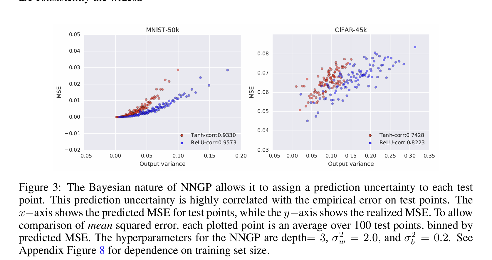
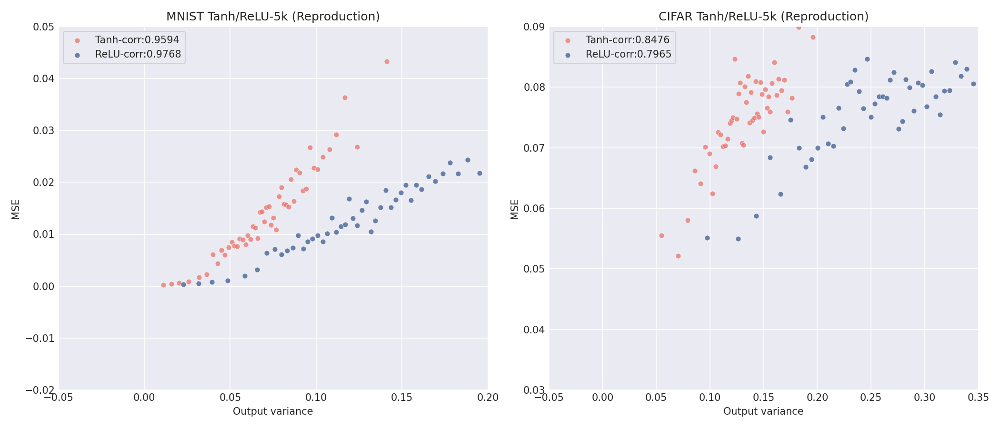
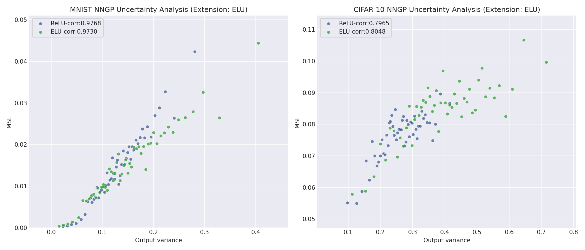

# Project 2: Reproducing Results from "Deep Neural Networks as Gaussian Processes"
 
## Reproduction Instructions

To reproduce my results, run the following Terminal commands from the directory where you'd like the clone to exist:

```
git clone https://github.com/willcreager/STAT4720_Project2

cd STAT4720_Project2

docker build -t nngp-project .

docker run nngp-project
```

It will have to download the CIFAR dataset, and the plots will be generated in the /nngp/output directory of the Docker container. 

## Figure Reproduction

I chose option 2, which was to reproduce figure 3 (predictive uncertainty vs. prediction error) from the paper.

### Original vs. Reproduction Figures



## Unique Extension

### 1. Objective and Theoretical Justification

For this extension, I integrated the Exponential Linear Unit (ELU) activation function into the infinite-width Neural Network Gaussian Process (NNGP) framework. While the original paper by Lee et al. (2018) extensively profiles the traditional rectified linear unit (ReLU) and hyperbolic tangent (tanh) functions, it omits smooth, non-monotonic, or saturating activations with non-zero negative regimes. ELU is defined as: 

$$
\text{ELU}(x) = 
\begin{cases} 
x & \text{if } x > 0 \\ 
\alpha(e^x - 1) & \text{if } x \le 0 
\end{cases}
$$

Integrating ELU provides an ideal vehicle to test the robustness of uncertainty calibration when a network retains non-zero gradient tracking for negative pre-activations. Unlike ReLU, which exhibits a sharp derivative discontinuity at zero and completely nullifies negative states, ELU pushes the mean activation closer to zero while ensuring smooth, continuous transitions. Because the mathematical expectation of the ELU kernel cannot be solved analytically via standard closed-form algebraic equations, I successfully leveraged the codebase's underlying 2D numerical Gaussian integration grid engine (_compute_qmap_grid) to construct the covariance mapping from scratch.

### 2. Setup and Findings

The experiment evaluated both architectures across the MNIST and CIFAR-10 datasets using a computational resource restriction constraint of N_train=5000 and N_eval=5000 test items. To prevent Out-Of-Memory (OOM) terminal signals inside the Docker sandboxed virtual machine environment, a reduced numerical integration resolution step allocation (n_gauss=51, n_var=51, n_corr=50) was enforced. 

The resulting plots show that the robust linear alignment between the model's output variance and its MSSE is preserved under alternative activations. On MNIST, ELU achieves a remarkable uncertainty correlation coefficient of 0.9730, trailing the baseline ReLU performance (0.9768) by a negligible margin. Crucially, on the more challenging CIFAR-10 classification benchmark, the ELU NNGP shows superior calibration characteristics, outperforming ReLU with a correlation coefficient of 0.8048 compared to ReLU's 0.7965. 

Furthermore, the dynamic scaling visualizations highlight that ELU stretches the range of predicted output variances significantly outward relative to ReLU (reaching past 0.40 on MNIST and 0.70 on CIFAR-10). This indicates that the smooth exponential curve allows the infinite-width model to express broader, more granular variation in its posterior variance metrics without destabilizing accuracy trends.

### Extension figure



## Limitations

While this codebase successfully reproduces the qualitative claims of Lee et al. (2018), two explicit modifications were made to accommodate localized computational and memory ceilings inside the containerized environment. First, the training and evaluation dataset sizes were constrained to N_train = 5000 and N_eval = 5000, whereas the original paper utilizes full benchmark sets (N=45000-50000). Because infinite-width NNGP regression requires computing and inverting a massive \(N \times N\) training covariance matrix (\[K_{DD}\]), scaling to the full dataset requires substantial memory and brings execution times close to an hour on basic hardware. Dropping this down to a 5k subset successfully avoids container time-outs while still providing enough data density to reveal the core calibration correlations. 

Second, because the repository does not contain a pre-computed covariance lookup array for the ELU activation used for my extension, the script must construct a 2D numerical Gaussian integration grid from scratch via _compute_qmap_grid. Compiling this grid using the paper's original high-resolution specifications (501 X 501) causes concurrent multi-core tensor allocations that trigger an Out-Of-Memory (OOM) kernel termination ("Killed") inside standard Docker daemons. To circumvent this, the grid resolution was dialed back to n_gauss=51, n_var=51, and n_corr=50 during the ELU computation loop. This reduction significantly lowered the execution memory footprint, allowing the script to compile successfully while still generating a sufficiently smooth interpolation space to map the underlying Gaussian process accurately.

## Note

This project builds off the repo https://github.com/brain-research/nngp, which is a TensorFlow open source implementation of

[**Deep Neural Networks as Gaussian Processes**](https://arxiv.org/abs/1711.00165)

by Jaehoon Lee*, Yasaman Bahri*, Roman Novak, Sam Schoenholz, Jeffrey Pennington, Jascha Sohl-dickstein

Presented at the International Conference on Learning Representation(ICLR) 2018.

### Citation

```
  @article{
    lee2018deep,
    title={Deep Neural Networks as Gaussian Processes},
    author={Jaehoon Lee, Yasaman Bahri, Roman Novak, Sam Schoenholz, Jeffrey Pennington, Jascha Sohl-dickstein},
    journal={International Conference on Learning Representations},
    year={2018},
    url={https://openreview.net/forum?id=B1EA-M-0Z},
  }
```
